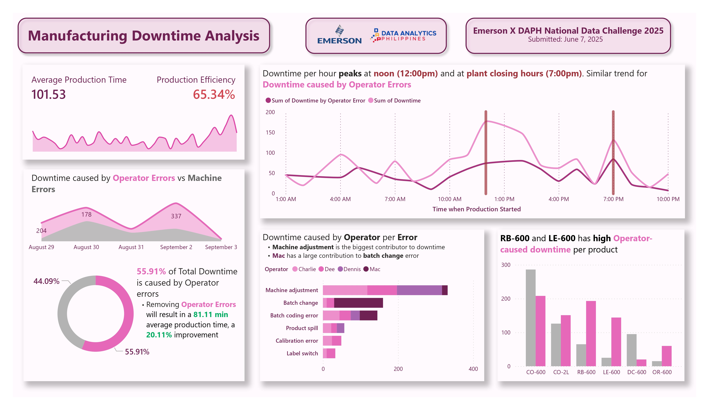
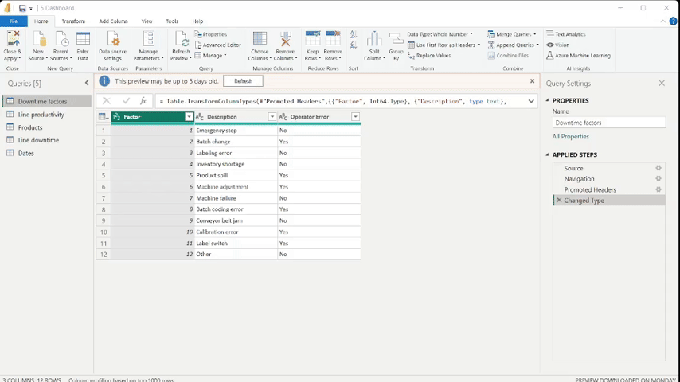

# Project Description

## Rationale
This project aims to create a Power BI report on the downtime analysis of a soda manufacturing production data. With the goal of creating a "report" with Exploratory Data Analysis (EDA) instead of an interactive dashboard with slicers. The target audience of this report is the stakeholders of the company who can make decisions based on the insights provided by the said report.

## Project Output
### Dashboard


### Key Insights
- 55.91% of Total Downtime is caused by Operator Errors. Removing these will result in an 81.11 average production time, a 20.11% improvement.
- Downtime per hour peaks at noon (12:00pm) and at closing hours (7:00pm) with a similar trend for operator-caused downtime.
- Machine adjustment accounts for the highest contribution for operator-caused downtime. Interestingly, Mac accounts for the highest contribution in batch change, but the lowest contribution to machine adjustment.
- RE-600 and LE-600 has noticeably high ratio of operator-caused downtime. OR-600 is also commendable. Whereas DC-600 has a high ratio of machine caused downtime.

### My Recommendations
- Examine the area during the noon and closing hours to find the root cause of the spike. Possible causes may include but not limited to;
  - the rising Philippine temperature, making working conditions for laborers uncomfortable during noon,
  - “End of work” effect, where operators (anticipating the end of their shift) may psychologically disengage from tasks.
- Operator training to reduce the effect of man-made error. Machine adjustment training for Charlie, Dee and Dennis and batch change training for Mac is recommended. Adding standard operating procedures and kanban system may prove useful.
- Process inspection and study especially for RB-600 and LE-600 is recommended to help identify possible work errors. DC-600 machine inspection is also recommended.

## Tools and Methodology
### Power BI
Used Power BI to create and design the report. Used DAX expressions to create calculated columns and measures as well as a `CALCULATE()` and `FILTER()` for creating bar/column charts.
```
Value not by Operator Error = 
  SUM('Line downtime'[Value]) - 
    CALCULATE(
      SUM('Line downtime'[Value]),
      FILTER('Downtime factors', 'Downtime factors'[Operator Error] = "Yes")
    )
```
```
Production Efficiency = [Ideal Avearage Batch Time] / [Average Batch Time]
```
```
Downtime = CALCULATE(
  SUM('Line downtime'[Value]),
    FILTER(
      'Line productivity', 
      'Line productivity'[Start Time] >= [Start Bin] && 'Line productivity'[Start Time] <= [End Bin]
    )
)
```
```
Downtime by Operator Error = CALCULATE(
  SUM('Line downtime'[Value]),
    FILTER(
      'Line productivity', 
      'Line productivity'[Start Time] >= [Start Bin] && 'Line productivity'[Start Time] <= [End Bin]
    ), FILTER (
      'Downtime factors',
      'Downtime factors'[Operator Error] = "Yes"
    )
)
```
### Power Query
Used Power query to upivot columns and assign data types for easier use in the Power BI interface.


## Learnings and Conclusion
This is actually my first ever dashboard in Power BI. I just finished a few datacamp tracks about the tool and was really intrigued so I went in and tried it myself. While I was trying the tool out, I saw a [post](https://web.facebook.com/share/p/19Vp6Ym3ck/) from DataSense Analytics on a competition about making a dashboard. So, I joined and tried my best to win, sadly I did not reach the finalist, but it was a great learning experience.

## Installation
### Prerequisites
- [Power BI Desktop](https://www.microsoft.com/en-us/download/details.aspx?id=58494)
### Setup
1. Download the [Power BI File](soda_manufacturing_dashboard.pbix).
2. Open the file using Power BI Desktop. 